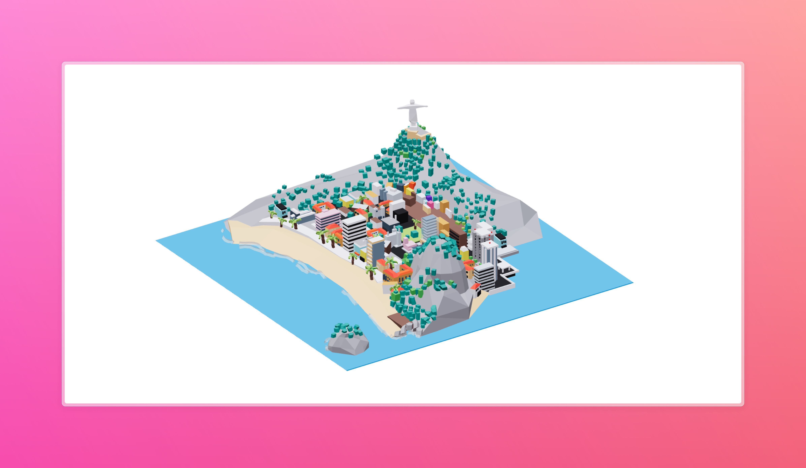

# 3D FOV Brazil Scene



[](https://reactjs.org/)
[](https://threejs.org/)
[](https://docs.pmnd.rs/react-three-fiber/)
[](https://www.typescriptlang.org/)
[](https://vitejs.dev/)

## 📝 Description

An immersive 3D scene showcasing Brazil's landscape using React Three Fiber and Three.js. This project demonstrates advanced 3D web development techniques including scene creation, lighting, camera controls, and animations.

## 🚀 Features

- Interactive 3D environment
- Dynamic lighting and shadows
- Camera controls for scene exploration
- Optimized 3D models and textures
- Responsive design for all devices
- Post-processing effects

## 🛠️ Installation

```bash
# Clone the repository
git clone https://github.com/pakagronglb/3d-fov-brazil-scene.git

# Navigate to project directory
cd 3d-fov-brazil-scene

# Install dependencies
npm install

# Start development server
npm run dev
```

## 🎮 Usage

1. Open your browser and navigate to `http://localhost:5173`
2. Use mouse/touch controls to explore the scene:
   - Left click + drag to rotate
   - Right click + drag to pan
   - Scroll to zoom

## 🔧 Tech Stack

- React
- Three.js
- React Three Fiber
- TypeScript
- Vite
- @react-three/drei
- @react-three/fiber

## 📚 Credits

This project was developed following the teachings and inspiration from [Wawa Sensei's React Three Fiber Course](https://wawasensei.dev/). Special thanks to Wawa Sensei for providing comprehensive tutorials and guidance in 3D web development.

## 🤝 Contributing

Contributions, issues, and feature requests are welcome! Feel free to check the [issues page](https://github.com/yourusername/3d-fov-brazil-scene/issues).

## 📝 License

This project is [MIT](LICENSE) licensed.

---
Built with 💖 following [Wawa Sensei's](https://wawasensei.dev/) 3D web development course.
